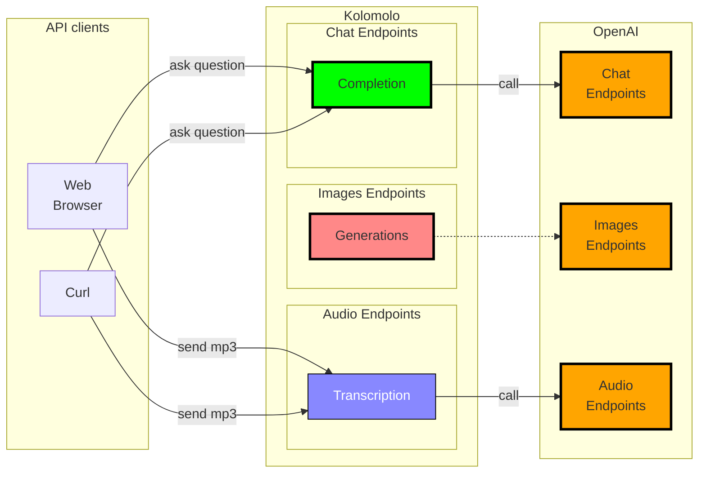

```mermaid
flowchart LR
    subgraph API clients
        WBR[Web<br>Browser]
        CURL[Curl]
    end
    subgraph "Kolomolo"
        subgraph "Chat Endpoints"
            CHT[Completion]:::greenBox
        end
        subgraph "Images Endpoints"
            IMG[Generations]:::redBox
        end
        subgraph "Audio Endpoints"
            AUD[Transcription]:::blueBox
        end
    end
    subgraph "OpenAI"
        AIC[Chat<br>Endpoints<br>]
        AII[Images<br>Endpoints<br>]
        AIA[Audio<br>Endpoints<br>]
    end
    WBR --> |ask question| CHT
    WBR --> |send mp3| AUD
    CURL --> |ask question| CHT
    CURL --> |send mp3| AUD
    CHT --> |call| AIC:::orangeBox
    IMG -.-> AII:::orangeBox
    AUD --> |call| AIA:::orangeBox
    classDef redBox     fill:#ff8888,stroke:#000,stroke-width:3px
    classDef greenBox   fill:#00ff00,stroke:#000,stroke-width:3px
    classDef blueBox    fill:#8888ff,stroke:#000,stroke-width:1px,color:#fff
    classDef orangeBox  fill:#ffa500,stroke:#000,stroke-width:3px
```