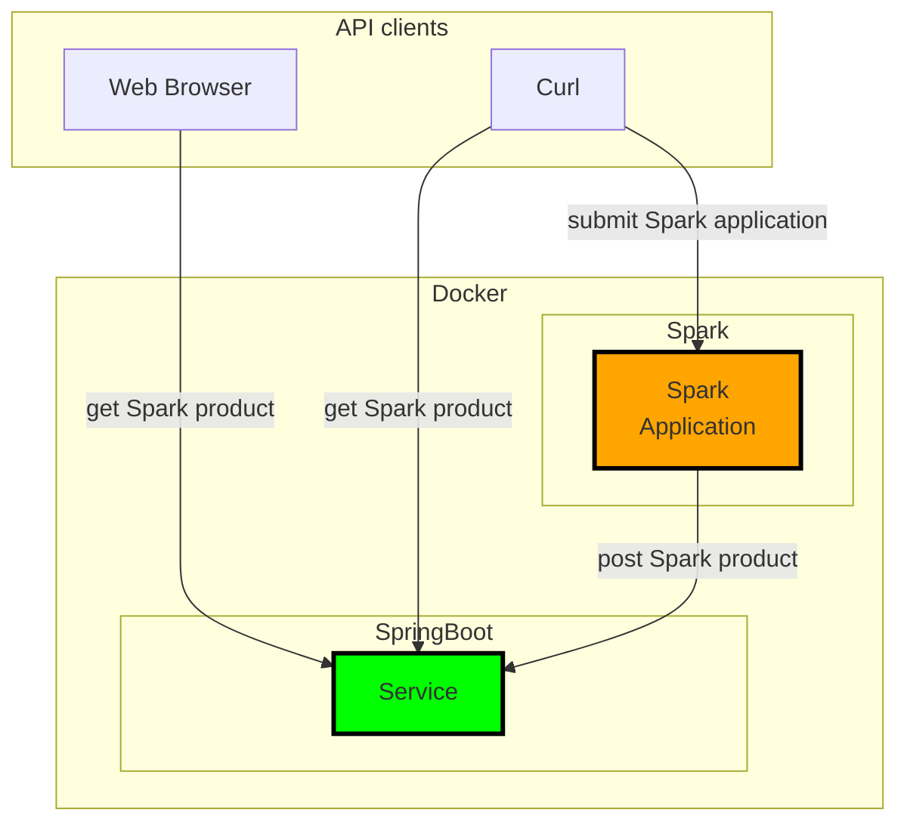

```mermaid
flowchart TD
    subgraph API clients
        WBR[Web Browser]
        CURL[Curl]
    end
    subgraph "Docker"
        subgraph "SpringBoot"
            SRV[Service]:::greenBox
        end
        subgraph "Spark"
            SP_APP[Spark<br>Application]:::orangeBox
        end
    end
    WBR --> |get Spark product| SRV
    CURL --> |get Spark product| SRV
    CURL --> |submit Spark application| SP_APP
    SP_APP --> |post Spark product| SRV
    classDef redBox     fill:#ff8888,stroke:#000,stroke-width:3px
    classDef greenBox   fill:#00ff00,stroke:#000,stroke-width:3px
    classDef blueBox    fill:#8888ff,stroke:#000,stroke-width:1px,color:#fff
    classDef orangeBox  fill:#ffa500,stroke:#000,stroke-width:3px
```